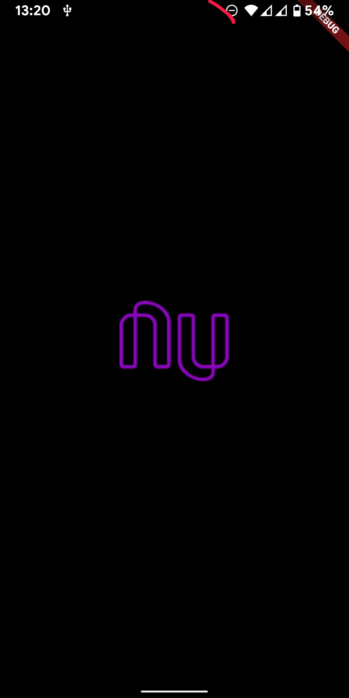
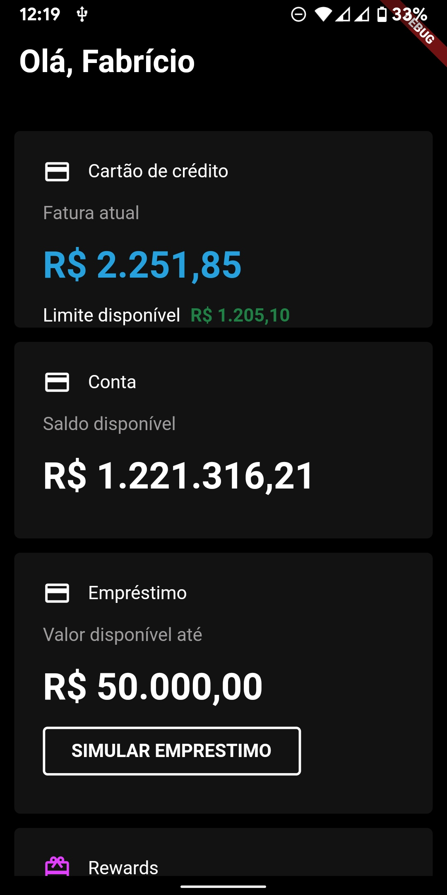

# Nubank Dark Mode Clone

Um aplicativo feito em flutter baseado no design de Felipe Mota no figma, para treinar a construção
de interfaces baseadas em design do Figma.

link do projeto do Felipe Mota: https://www.figma.com/community/file/1010233485805538860

## 🖼️ Imagens

 

    
    
 

### 🛠 Tecnologias

As seguintes ferramentas foram usadas na construção do projeto:

- [Dart](https://dart.dev/)
- [Flutter](https://flutter.dev/)
- [Figma](https://www.figma.com/community/)
